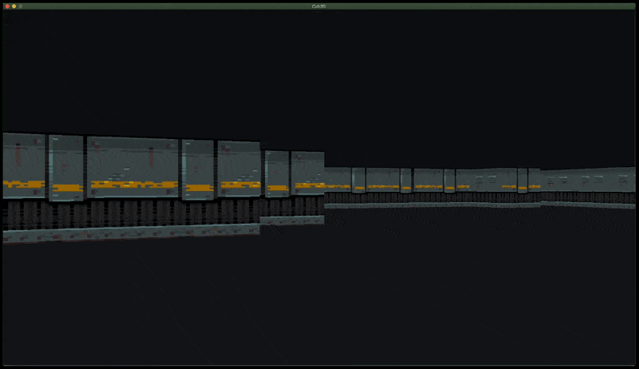

# cub3D

```
FINAL GRADE: 120/100
```

cub3D is a duo graphic project. In this one, we create a game that looks like an old FPS, like Wolfenstein 3D. So we have Raycasting to do in C, and a very minimalist graphics library, the MinilibX.


*Textures from [little-martian](https://little-martian.itch.io/retro-texture-pack).*

## Build and launch

⚠️ cub3D will only work on MacOS (because of this shitty minilibX)

```bash
make
./cub3D <path/to/map>
```

You will find maps in the sub-folder `./maps`, you can also create your own.
